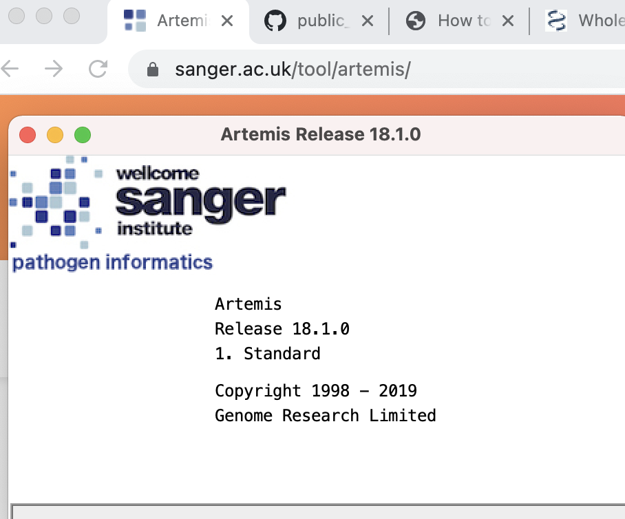

# From zero to hero: a bioinformatician guide
---
*12/07/2021*

## Table of Contents
* [Basic setup for bioinformaticians](#Basic)
* [Upgrade R for bioinformaticians](#Rupgrade)
* [GitHub Desktop](#gitdesk)


<a name="Basic"></a>
## Basic setup for bioinformaticians

One question I often get asked is what laptop to get for bioinformatics? You can get
any that runs Linux or a Unix flavour operating system. If you have the money, go for MacBook Pro because
it has nice display.

I have recently purchased a new MacBook Pro (13-inch, 2020, Four Thunderbolt 3 ports,
2 GHz Quad-Core Intel Core i5, 32 GB 3733 MHz LPDDR4X, Intel Iris Plus Graphics 1536 MB).
I am running MacOS Big Sur 11.4. In this article, I will show how I set it up for bioinformatics use starting from scratch
without using time machine to migrate data from the old laptop to this new one. This should
be useful to someone who is starting new in bioinformatics. Do note that my work area is
in the sequencing space so it will be different to someone working in say the proteomics space.

After you open the Mac and follow the instructions to get touch ID, Apple ID etc set up, you'll
be ready for something deeper that I'll describe below. When setting up, basic things you'll
need is email and if you collaborate with people who use Microsoft, then you will need
at least Microsoft Word. For email, under `System Preferences > Internet Accounts`, you'll
find that you can set up multiple emails. Anyway, these basic things should be familiar to many
people so let's not waste time here.

I do not like the default zsh shell that comes with Mac nowadays. So, first thing I did is change it to bash. From the terminal,
`/System/Applications/Utilities/Terminal.app`, I changed it as below

```bash
chsh -s /bin/bash
```

which looks like this if you haven't seen one before.


Then I created `.bashrc` and `.bash_profile` files in `$HOME` based on my previous laptop. Where
is your `$HOME`? Just type `echo $HOME` in the terminal, and you'll find it.
As the content in `.bashrc` and `.bash_profile` is personal,
I will not display it here. You will find it useful to have these hidden files set up
for aliases and exporting path to programs/software that you use. Aliases are great to create
short commands to login to server.

Then I installed Java development kit `java version "16.0.1" 2021-04-20`: https://www.oracle.com/au/java/technologies/javase-downloads.html simply because many tools will likely use Java.

The I get myself a text editor. I use Atom: https://atom.io/

As I view sequences a lot, I need [Artemis](https://www.sanger.ac.uk/tool/artemis/) installed. There are other genome or sequence
browser but I like this one.

Useful page for Artemis commands: https://sanger-pathogens.github.io/Artemis/Artemis/artemis-manual.html#_Toc532218858

Somehow, I found installing straight with git clone as per this link does not work: https://github.com/sanger-pathogens/Artemis

After git clone, I got below error. Not sure why but I tried conda to install it.
```console
a1223107@LC02FV06VML85:~/Documents/Software/Artemis$ ./art
Starting Artemis with arguments: -mx2g -ms100m -noverify --add-opens=java.base/java.lang=ALL-UNNAMED --add-opens=java.base/java.util=ALL-UNNAMED -Djdbc.drivers=org.postgresql.Driver -Dartemis.environment=UNIX  -Dapple.laf.useScreenMenuBar=true -Xdock:name=Artemis
Java HotSpot(TM) 64-Bit Server VM warning: Options -Xverify:none and -noverify were deprecated in JDK 13 and will likely be removed in a future release.
Error: Could not find or load main class uk.ac.sanger.artemis.components.ArtemisMain
Caused by: java.lang.ClassNotFoundException: uk.ac.sanger.artemis.components.ArtemisMain
```

Trying to set up conda now to install Artemis.

Figured that I do not even have brew to use wget as this is a new laptop!
So, need to get homebrew first from here: https://brew.sh/
If you wish to know, I even show how the installation log looks like below.

```bash
/bin/bash -c "$(curl -fsSL https://raw.githubusercontent.com/Homebrew/install/HEAD/install.sh)"
```

<details>
<summary>
<i> BREW installation </i>
</summary>
<p>
==> Checking for `sudo` access (which may request your password).
Password:
==> This script will install:
/usr/local/bin/brew
/usr/local/share/doc/homebrew
/usr/local/share/man/man1/brew.1
/usr/local/share/zsh/site-functions/_brew
/usr/local/etc/bash_completion.d/brew
/usr/local/Homebrew
==> The following existing directories will be made group writable:
/usr/local/bin
/usr/local/include
/usr/local/lib
/usr/local/share
/usr/local/lib/pkgconfig
/usr/local/share/info
/usr/local/share/man
/usr/local/share/man/man1
/usr/local/share/man/man3
/usr/local/share/man/man5
==> The following existing directories will have their owner set to a1223107:
/usr/local/bin
/usr/local/include
/usr/local/lib
/usr/local/share
/usr/local/lib/pkgconfig
/usr/local/share/info
/usr/local/share/man
/usr/local/share/man/man1
/usr/local/share/man/man3
/usr/local/share/man/man5
==> The following existing directories will have their group set to admin:
/usr/local/bin
/usr/local/include
/usr/local/lib
/usr/local/share
/usr/local/lib/pkgconfig
/usr/local/share/info
/usr/local/share/man
/usr/local/share/man/man1
/usr/local/share/man/man3
/usr/local/share/man/man5
==> The following new directories will be created:
/usr/local/etc
/usr/local/sbin
/usr/local/var
/usr/local/opt
/usr/local/share/zsh
/usr/local/share/zsh/site-functions
/usr/local/var/homebrew
/usr/local/var/homebrew/linked
/usr/local/Cellar
/usr/local/Caskroom
/usr/local/Frameworks

Press RETURN to continue or any other key to abort
==> /usr/bin/sudo /bin/chmod u+rwx /usr/local/bin /usr/local/include /usr/local/lib /usr/local/share /usr/local/lib/pkgconfig /usr/local/share/info /usr/local/share/man /usr/local/share/man/man1 /usr/local/share/man/man3 /usr/local/share/man/man5
<...truncated some lines here...>
==> Downloading and installing Homebrew...
remote: Enumerating objects: 187070, done.
remote: Counting objects: 100% (222/222), done.
remote: Compressing objects: 100% (134/134), done.
remote: Total 187070 (delta 96), reused 196 (delta 82), pack-reused 186848
Receiving objects: 100% (187070/187070), 50.59 MiB | 2.35 MiB/s, done.
Resolving deltas: 100% (138668/138668), done.
From https://github.com/Homebrew/brew
 * [new branch]          automerge-linux -> origin/automerge-linux
 * [new branch]          dependabot/bundler/Library/Homebrew/sorbet-0.5.6442 -> origin/dependabot/bundler/Library/Homebrew/sorbet-0.5.6442
 * [new branch]          master          -> origin/master
 * [new tag]             0.1             -> 0.1
 * [new tag]             0.2             -> 0.2
 * [new tag]             0.3             -> 0.3
 * [new tag]             0.4             -> 0.4
 * [new tag]             0.5             -> 0.5
 * [new tag]             0.6             -> 0.6
 * [new tag]             0.7             -> 0.7
 * [new tag]             0.7.1           -> 0.7.1
 * [new tag]             0.8             -> 0.8
 * [new tag]             0.8.1           -> 0.8.1
 * [new tag]             0.9             -> 0.9
 * [new tag]             0.9.1           -> 0.9.1
 * [new tag]             0.9.2           -> 0.9.2
 * [new tag]             0.9.3           -> 0.9.3
 * [new tag]             0.9.4           -> 0.9.4
 * [new tag]             0.9.5           -> 0.9.5
 * [new tag]             0.9.8           -> 0.9.8
 * [new tag]             0.9.9           -> 0.9.9
 * [new tag]             1.0.0           -> 1.0.0
 * [new tag]             1.0.1           -> 1.0.1
 * [new tag]             1.0.2           -> 1.0.2
 * [new tag]             1.0.3           -> 1.0.3
 * [new tag]             1.0.4           -> 1.0.4
 * [new tag]             1.0.5           -> 1.0.5
 * [new tag]             1.0.6           -> 1.0.6
 * [new tag]             1.0.7           -> 1.0.7
 * [new tag]             1.0.8           -> 1.0.8
 * [new tag]             1.0.9           -> 1.0.9
 * [new tag]             1.1.0           -> 1.1.0
 * [new tag]             1.1.1           -> 1.1.1
 * [new tag]             1.1.10          -> 1.1.10
 * [new tag]             1.1.11          -> 1.1.11
 * [new tag]             1.1.12          -> 1.1.12
 * [new tag]             1.1.13          -> 1.1.13
 * [new tag]             1.1.2           -> 1.1.2
 * [new tag]             1.1.3           -> 1.1.3
 * [new tag]             1.1.4           -> 1.1.4
 * [new tag]             1.1.5           -> 1.1.5
 * [new tag]             1.1.6           -> 1.1.6
 * [new tag]             1.1.7           -> 1.1.7
 * [new tag]             1.1.8           -> 1.1.8
 * [new tag]             1.1.9           -> 1.1.9
 * [new tag]             1.2.0           -> 1.2.0
 * [new tag]             1.2.1           -> 1.2.1
 * [new tag]             1.2.2           -> 1.2.2
 * [new tag]             1.2.3           -> 1.2.3
 * [new tag]             1.2.4           -> 1.2.4
 * [new tag]             1.2.5           -> 1.2.5
 * [new tag]             1.2.6           -> 1.2.6
 * [new tag]             1.3.0           -> 1.3.0
 * [new tag]             1.3.1           -> 1.3.1
 * [new tag]             1.3.2           -> 1.3.2
 * [new tag]             1.3.3           -> 1.3.3
 * [new tag]             1.3.4           -> 1.3.4
 * [new tag]             1.3.5           -> 1.3.5
 * [new tag]             1.3.6           -> 1.3.6
 * [new tag]             1.3.7           -> 1.3.7
 * [new tag]             1.3.8           -> 1.3.8
 * [new tag]             1.3.9           -> 1.3.9
 * [new tag]             1.4.0           -> 1.4.0
 * [new tag]             1.4.1           -> 1.4.1
 * [new tag]             1.4.2           -> 1.4.2
 * [new tag]             1.4.3           -> 1.4.3
 * [new tag]             1.5.0           -> 1.5.0
 * [new tag]             1.5.1           -> 1.5.1
 * [new tag]             1.5.10          -> 1.5.10
 * [new tag]             1.5.11          -> 1.5.11
 * [new tag]             1.5.12          -> 1.5.12
 * [new tag]             1.5.13          -> 1.5.13
 * [new tag]             1.5.14          -> 1.5.14
 * [new tag]             1.5.2           -> 1.5.2
 * [new tag]             1.5.3           -> 1.5.3
 * [new tag]             1.5.4           -> 1.5.4
 * [new tag]             1.5.5           -> 1.5.5
 * [new tag]             1.5.6           -> 1.5.6
 * [new tag]             1.5.7           -> 1.5.7
 * [new tag]             1.5.8           -> 1.5.8
 * [new tag]             1.5.9           -> 1.5.9
 * [new tag]             1.6.0           -> 1.6.0
 * [new tag]             1.6.1           -> 1.6.1
 * [new tag]             1.6.10          -> 1.6.10
 * [new tag]             1.6.11          -> 1.6.11
 * [new tag]             1.6.12          -> 1.6.12
 * [new tag]             1.6.13          -> 1.6.13
 * [new tag]             1.6.14          -> 1.6.14
 * [new tag]             1.6.15          -> 1.6.15
 * [new tag]             1.6.16          -> 1.6.16
 * [new tag]             1.6.17          -> 1.6.17
 * [new tag]             1.6.2           -> 1.6.2
 * [new tag]             1.6.3           -> 1.6.3
 * [new tag]             1.6.4           -> 1.6.4
 * [new tag]             1.6.5           -> 1.6.5
 * [new tag]             1.6.6           -> 1.6.6
 * [new tag]             1.6.7           -> 1.6.7
 * [new tag]             1.6.8           -> 1.6.8
 * [new tag]             1.6.9           -> 1.6.9
 * [new tag]             1.7.0           -> 1.7.0
 * [new tag]             1.7.1           -> 1.7.1
 * [new tag]             1.7.2           -> 1.7.2
 * [new tag]             1.7.3           -> 1.7.3
 * [new tag]             1.7.4           -> 1.7.4
 * [new tag]             1.7.5           -> 1.7.5
 * [new tag]             1.7.6           -> 1.7.6
 * [new tag]             1.7.7           -> 1.7.7
 * [new tag]             1.8.0           -> 1.8.0
 * [new tag]             1.8.1           -> 1.8.1
 * [new tag]             1.8.2           -> 1.8.2
 * [new tag]             1.8.3           -> 1.8.3
 * [new tag]             1.8.4           -> 1.8.4
 * [new tag]             1.8.5           -> 1.8.5
 * [new tag]             1.8.6           -> 1.8.6
 * [new tag]             1.9.0           -> 1.9.0
 * [new tag]             1.9.1           -> 1.9.1
 * [new tag]             1.9.2           -> 1.9.2
 * [new tag]             1.9.3           -> 1.9.3
 * [new tag]             2.0.0           -> 2.0.0
 * [new tag]             2.0.1           -> 2.0.1
 * [new tag]             2.0.2           -> 2.0.2
 * [new tag]             2.0.3           -> 2.0.3
 * [new tag]             2.0.4           -> 2.0.4
 * [new tag]             2.0.5           -> 2.0.5
 * [new tag]             2.0.6           -> 2.0.6
 * [new tag]             2.1.0           -> 2.1.0
 * [new tag]             2.1.1           -> 2.1.1
 * [new tag]             2.1.10          -> 2.1.10
 * [new tag]             2.1.11          -> 2.1.11
 * [new tag]             2.1.12          -> 2.1.12
 * [new tag]             2.1.13          -> 2.1.13
 * [new tag]             2.1.14          -> 2.1.14
 * [new tag]             2.1.15          -> 2.1.15
 * [new tag]             2.1.16          -> 2.1.16
 * [new tag]             2.1.2           -> 2.1.2
 * [new tag]             2.1.3           -> 2.1.3
 * [new tag]             2.1.4           -> 2.1.4
 * [new tag]             2.1.5           -> 2.1.5
 * [new tag]             2.1.6           -> 2.1.6
 * [new tag]             2.1.7           -> 2.1.7
 * [new tag]             2.1.8           -> 2.1.8
 * [new tag]             2.1.9           -> 2.1.9
 * [new tag]             2.2.0           -> 2.2.0
 * [new tag]             2.2.1           -> 2.2.1
 * [new tag]             2.2.10          -> 2.2.10
 * [new tag]             2.2.11          -> 2.2.11
 * [new tag]             2.2.12          -> 2.2.12
 * [new tag]             2.2.13          -> 2.2.13
 * [new tag]             2.2.14          -> 2.2.14
 * [new tag]             2.2.15          -> 2.2.15
 * [new tag]             2.2.16          -> 2.2.16
 * [new tag]             2.2.17          -> 2.2.17
 * [new tag]             2.2.2           -> 2.2.2
 * [new tag]             2.2.3           -> 2.2.3
 * [new tag]             2.2.4           -> 2.2.4
 * [new tag]             2.2.5           -> 2.2.5
 * [new tag]             2.2.6           -> 2.2.6
 * [new tag]             2.2.7           -> 2.2.7
 * [new tag]             2.2.8           -> 2.2.8
 * [new tag]             2.2.9           -> 2.2.9
 * [new tag]             2.3.0           -> 2.3.0
 * [new tag]             2.4.0           -> 2.4.0
 * [new tag]             2.4.1           -> 2.4.1
 * [new tag]             2.4.10          -> 2.4.10
 * [new tag]             2.4.11          -> 2.4.11
 * [new tag]             2.4.12          -> 2.4.12
 * [new tag]             2.4.13          -> 2.4.13
 * [new tag]             2.4.14          -> 2.4.14
 * [new tag]             2.4.15          -> 2.4.15
 * [new tag]             2.4.16          -> 2.4.16
 * [new tag]             2.4.2           -> 2.4.2
 * [new tag]             2.4.3           -> 2.4.3
 * [new tag]             2.4.4           -> 2.4.4
 * [new tag]             2.4.5           -> 2.4.5
 * [new tag]             2.4.6           -> 2.4.6
 * [new tag]             2.4.7           -> 2.4.7
 * [new tag]             2.4.8           -> 2.4.8
 * [new tag]             2.4.9           -> 2.4.9
 * [new tag]             2.5.0           -> 2.5.0
 * [new tag]             2.5.1           -> 2.5.1
 * [new tag]             2.5.10          -> 2.5.10
 * [new tag]             2.5.11          -> 2.5.11
 * [new tag]             2.5.12          -> 2.5.12
 * [new tag]             2.5.2           -> 2.5.2
 * [new tag]             2.5.3           -> 2.5.3
 * [new tag]             2.5.4           -> 2.5.4
 * [new tag]             2.5.5           -> 2.5.5
 * [new tag]             2.5.6           -> 2.5.6
 * [new tag]             2.5.7           -> 2.5.7
 * [new tag]             2.5.8           -> 2.5.8
 * [new tag]             2.5.9           -> 2.5.9
 * [new tag]             2.6.0           -> 2.6.0
 * [new tag]             2.6.1           -> 2.6.1
 * [new tag]             2.6.2           -> 2.6.2
 * [new tag]             2.7.0           -> 2.7.0
 * [new tag]             2.7.1           -> 2.7.1
 * [new tag]             2.7.2           -> 2.7.2
 * [new tag]             2.7.3           -> 2.7.3
 * [new tag]             2.7.4           -> 2.7.4
 * [new tag]             2.7.5           -> 2.7.5
 * [new tag]             2.7.6           -> 2.7.6
 * [new tag]             2.7.7           -> 2.7.7
 * [new tag]             3.0.0           -> 3.0.0
 * [new tag]             3.0.1           -> 3.0.1
 * [new tag]             3.0.10          -> 3.0.10
 * [new tag]             3.0.11          -> 3.0.11
 * [new tag]             3.0.2           -> 3.0.2
 * [new tag]             3.0.3           -> 3.0.3
 * [new tag]             3.0.4           -> 3.0.4
 * [new tag]             3.0.5           -> 3.0.5
 * [new tag]             3.0.6           -> 3.0.6
 * [new tag]             3.0.7           -> 3.0.7
 * [new tag]             3.0.8           -> 3.0.8
 * [new tag]             3.0.9           -> 3.0.9
 * [new tag]             3.1.0           -> 3.1.0
 * [new tag]             3.1.1           -> 3.1.1
 * [new tag]             3.1.10          -> 3.1.10
 * [new tag]             3.1.11          -> 3.1.11
 * [new tag]             3.1.12          -> 3.1.12
 * [new tag]             3.1.2           -> 3.1.2
 * [new tag]             3.1.3           -> 3.1.3
 * [new tag]             3.1.4           -> 3.1.4
 * [new tag]             3.1.5           -> 3.1.5
 * [new tag]             3.1.6           -> 3.1.6
 * [new tag]             3.1.7           -> 3.1.7
 * [new tag]             3.1.8           -> 3.1.8
 * [new tag]             3.1.9           -> 3.1.9
 * [new tag]             3.2.0           -> 3.2.0
 * [new tag]             3.2.1           -> 3.2.1
HEAD is now at 5659d74ff Merge pull request #11646 from chenrui333/add-test-epub
==> Tapping homebrew/core
remote: Enumerating objects: 996444, done.
remote: Counting objects: 100% (14/14), done.
remote: Compressing objects: 100% (10/10), done.
remote: Total 996444 (delta 6), reused 9 (delta 4), pack-reused 996430
Receiving objects: 100% (996444/996444), 398.02 MiB | 2.34 MiB/s, done.
Resolving deltas: 100% (680530/680530), done.
From https://github.com/Homebrew/homebrew-core
 * [new branch]            master     -> origin/master
Updating files: 100% (5995/5995), done.
HEAD is now at d7f42b1af4 you-get: update 0.4.1536 bottle.
==> Installation successful!

==> Homebrew has enabled anonymous aggregate formulae and cask analytics.
Read the analytics documentation (and how to opt-out) here:
  https://docs.brew.sh/Analytics
No analytics data has been sent yet (or will be during this `install` run).

==> Homebrew is run entirely by unpaid volunteers. Please consider donating:
  https://github.com/Homebrew/brew#donations

==> Next steps:
- Run `brew help` to get started
- Further documentation:
    https://docs.brew.sh

</p>
</details>

Then get wget with brew. Note that MacOS comes with `curl` that does similar thing
like `wget` but I like `wget` better.

```console
brew install wget
```

<details>
<summary>
<i> BREW installation of wget </i>
</summary>
<p>
==> Downloading https://ghcr.io/v2/homebrew/core/gettext/manifests/0.21
######################################################################## 100.0%
==> Downloading https://ghcr.io/v2/homebrew/core/gettext/blobs/sha256:a025e143fe3f5f7e24a936b8b
==> Downloading from https://pkg-containers.githubusercontent.com/ghcr1/blobs/sha256:a025e143fe
######################################################################## 100.0%
==> Downloading https://ghcr.io/v2/homebrew/core/libunistring/manifests/0.9.10
######################################################################## 100.0%
==> Downloading https://ghcr.io/v2/homebrew/core/libunistring/blobs/sha256:5d336bd939f678b48dc1
==> Downloading from https://pkg-containers.githubusercontent.com/ghcr1/blobs/sha256:5d336bd939
######################################################################## 100.0%
==> Downloading https://ghcr.io/v2/homebrew/core/libidn2/manifests/2.3.1-1
######################################################################## 100.0%
==> Downloading https://ghcr.io/v2/homebrew/core/libidn2/blobs/sha256:25c6ccfc501690f453ebcb4ce
==> Downloading from https://pkg-containers.githubusercontent.com/ghcr1/blobs/sha256:25c6ccfc50
######################################################################## 100.0%
==> Downloading https://ghcr.io/v2/homebrew/core/openssl/1.1/manifests/1.1.1k
######################################################################## 100.0%
==> Downloading https://ghcr.io/v2/homebrew/core/openssl/1.1/blobs/sha256:17d94c51ddfa8364baed5
==> Downloading from https://pkg-containers.githubusercontent.com/ghcr1/blobs/sha256:17d94c51dd
######################################################################## 100.0%
==> Downloading https://ghcr.io/v2/homebrew/core/wget/manifests/1.21.1-1
######################################################################## 100.0%
==> Downloading https://ghcr.io/v2/homebrew/core/wget/blobs/sha256:277577a3a30ff9bf60d0e4b81957
==> Downloading from https://pkg-containers.githubusercontent.com/ghcr1/blobs/sha256:277577a3a3
######################################################################## 100.0%
==> Installing dependencies for wget: gettext, libunistring, libidn2 and openssl@1.1
==> Installing wget dependency: gettext
==> Pouring gettext--0.21.big_sur.bottle.tar.gz
🍺  /usr/local/Cellar/gettext/0.21: 1,953 files, 19.8MB
==> Installing wget dependency: libunistring
==> Pouring libunistring--0.9.10.big_sur.bottle.tar.gz
🍺  /usr/local/Cellar/libunistring/0.9.10: 55 files, 4.5MB
==> Installing wget dependency: libidn2
==> Pouring libidn2--2.3.1.big_sur.bottle.1.tar.gz
🍺  /usr/local/Cellar/libidn2/2.3.1: 73 files, 812.3KB
==> Installing wget dependency: openssl@1.1
==> Pouring openssl@1.1--1.1.1k.big_sur.bottle.tar.gz
==> Regenerating CA certificate bundle from keychain, this may take a while...
🍺  /usr/local/Cellar/openssl@1.1/1.1.1k: 8,071 files, 18.5MB
==> Installing wget
==> Pouring wget--1.21.1.big_sur.bottle.1.tar.gz
🍺  /usr/local/Cellar/wget/1.21.1: 88 files, 4MB
</p>
</details>

Getting miniconda. Below are two useful wep pages for this purpose.

https://docs.conda.io/projects/continuumio-conda/en/latest/user-guide/install/macos.html

https://docs.conda.io/projects/continuumio-conda/en/latest/user-guide/getting-started.html#starting-conda

<details>
<summary>
<i> conda installation </i>
</summary>
<p>

```console
$ wget https://repo.anaconda.com/miniconda/Miniconda3-latest-MacOSX-x86_64.sh -O ~/miniconda.sh
--2021-07-12 14:39:40--  https://repo.anaconda.com/miniconda/Miniconda3-latest-MacOSX-x86_64.sh
<...truncated some lines...>
HTTP request sent, awaiting response... 200 OK
Length: 57112343 (54M) [application/x-sh]
Saving to: ‘/Users/XXX/miniconda.sh’

/Users/XXX/minicon 100%[==============================>]  54.47M  2.38MB/s    in 23s

2021-07-12 14:40:03 (2.37 MB/s) - ‘/Users/XXX/miniconda.sh’ saved [57112343/57112343]

$ bash ~/miniconda.sh -b -p $HOME/miniconda
PREFIX=/Users/XXX/miniconda
Unpacking payload ...
Collecting package metadata (current_repodata.json): done
Solving environment: done

## Package Plan ##

  environment location: /Users/XXX/miniconda

  added / updated specs:
    - brotlipy==0.7.0=py38h9ed2024_1003
    - ca-certificates==2020.10.14=0
    - certifi==2020.6.20=pyhd3eb1b0_3
    - cffi==1.14.3=py38h2125817_2
    - chardet==3.0.4=py38hecd8cb5_1003
    - conda-package-handling==1.7.2=py38h22f3db7_0
    - conda==4.9.2=py38hecd8cb5_0
    - cryptography==3.2.1=py38hbcfaee0_1
    - idna==2.10=py_0
    - libcxx==10.0.0=1
    - libedit==3.1.20191231=h1de35cc_1
    - libffi==3.3=hb1e8313_2
    - ncurses==6.2=h0a44026_1
    - openssl==1.1.1h=haf1e3a3_0
    - pip==20.2.4=py38hecd8cb5_0
    - pycosat==0.6.3=py38h1de35cc_1
    - pycparser==2.20=py_2
    - pyopenssl==19.1.0=pyhd3eb1b0_1
    - pysocks==1.7.1=py38_1
    - python.app==2=py38_10
    - python==3.8.5=h26836e1_1
    - readline==8.0=h1de35cc_0
    - requests==2.24.0=py_0
    - ruamel_yaml==0.15.87=py38haf1e3a3_1
    - setuptools==50.3.1=py38hecd8cb5_1
    - six==1.15.0=py38hecd8cb5_0
    - sqlite==3.33.0=hffcf06c_0
    - tk==8.6.10=hb0a8c7a_0
    - tqdm==4.51.0=pyhd3eb1b0_0
    - urllib3==1.25.11=py_0
    - wheel==0.35.1=pyhd3eb1b0_0
    - xz==5.2.5=h1de35cc_0
    - yaml==0.2.5=haf1e3a3_0
    - zlib==1.2.11=h1de35cc_3


The following NEW packages will be INSTALLED:

  brotlipy           pkgs/main/osx-64::brotlipy-0.7.0-py38h9ed2024_1003
  ca-certificates    pkgs/main/osx-64::ca-certificates-2020.10.14-0
  certifi            pkgs/main/noarch::certifi-2020.6.20-pyhd3eb1b0_3
  cffi               pkgs/main/osx-64::cffi-1.14.3-py38h2125817_2
  chardet            pkgs/main/osx-64::chardet-3.0.4-py38hecd8cb5_1003
  conda              pkgs/main/osx-64::conda-4.9.2-py38hecd8cb5_0
  conda-package-han~ pkgs/main/osx-64::conda-package-handling-1.7.2-py38h22f3db7_0
  cryptography       pkgs/main/osx-64::cryptography-3.2.1-py38hbcfaee0_1
  idna               pkgs/main/noarch::idna-2.10-py_0
  libcxx             pkgs/main/osx-64::libcxx-10.0.0-1
  libedit            pkgs/main/osx-64::libedit-3.1.20191231-h1de35cc_1
  libffi             pkgs/main/osx-64::libffi-3.3-hb1e8313_2
  ncurses            pkgs/main/osx-64::ncurses-6.2-h0a44026_1
  openssl            pkgs/main/osx-64::openssl-1.1.1h-haf1e3a3_0
  pip                pkgs/main/osx-64::pip-20.2.4-py38hecd8cb5_0
  pycosat            pkgs/main/osx-64::pycosat-0.6.3-py38h1de35cc_1
  pycparser          pkgs/main/noarch::pycparser-2.20-py_2
  pyopenssl          pkgs/main/noarch::pyopenssl-19.1.0-pyhd3eb1b0_1
  pysocks            pkgs/main/osx-64::pysocks-1.7.1-py38_1
  python             pkgs/main/osx-64::python-3.8.5-h26836e1_1
  python.app         pkgs/main/osx-64::python.app-2-py38_10
  readline           pkgs/main/osx-64::readline-8.0-h1de35cc_0
  requests           pkgs/main/noarch::requests-2.24.0-py_0
  ruamel_yaml        pkgs/main/osx-64::ruamel_yaml-0.15.87-py38haf1e3a3_1
  setuptools         pkgs/main/osx-64::setuptools-50.3.1-py38hecd8cb5_1
  six                pkgs/main/osx-64::six-1.15.0-py38hecd8cb5_0
  sqlite             pkgs/main/osx-64::sqlite-3.33.0-hffcf06c_0
  tk                 pkgs/main/osx-64::tk-8.6.10-hb0a8c7a_0
  tqdm               pkgs/main/noarch::tqdm-4.51.0-pyhd3eb1b0_0
  urllib3            pkgs/main/noarch::urllib3-1.25.11-py_0
  wheel              pkgs/main/noarch::wheel-0.35.1-pyhd3eb1b0_0
  xz                 pkgs/main/osx-64::xz-5.2.5-h1de35cc_0
  yaml               pkgs/main/osx-64::yaml-0.2.5-haf1e3a3_0
  zlib               pkgs/main/osx-64::zlib-1.2.11-h1de35cc_3


Preparing transaction: done
Executing transaction: done
installation finished.
```
</p>
</details>

Making conda always available when shell opens, hence the `(base)` in the command
prompt. Note that you'll need to substitute the path to your own miniconda. It should
be in `$HOME/miniconda/bin`

```console
$ source <path-to>miniconda/bin/activate
(base) XXX:~$ conda init
```

Then I `conda deactivate` and closed the terminal.

Open a new one in `$HOME`. Note that the environment for conda is always activated now.

Now I can get Artemis.

```console
conda install -c bioconda artemis
```

After the installation, you can run Artemis anywhere from your terminal by typing `art`.

```console
art
Starting Artemis with arguments: -mx2g -ms100m -noverify --add-opens=java.base/java.lang=ALL-UNNAMED --add-opens=java.base/java.util=ALL-UNNAMED -Djdbc.drivers=org.postgresql.Driver -Dartemis.environment=UNIX  -Dapple.laf.useScreenMenuBar=true -Xdock:name=Artemis
```



<a name="Rupgrade"></a>
## Upgrading R/Rstudio or reinstall packages from old laptop to new one

This is to reinstall R and Rstudio on my new MacBook Pro. The `installed_old.rda` object can
be from an existing laptop that one wishes to upgrade the R version or from an
older laptop migrated to the newer one. Therefore, the method below will work whether
you are upgrading or reinstalling on a new laptop.

Note that some personal packages such as from GitHub that are not part of CRAN and
BioConductor will not be installed and these need to be managed individually for now.
Fortunately, I do not have many of these packages, maybe under 10 packages.

```R
#Before you upgrade, build a temp file with all of your old packages.
tmp <- installed.packages()
installedpkgs <- as.vector(tmp[is.na(tmp[,"Priority"]), 1])
save(installedpkgs, file="installed_old.rda")

#useful to see packages info sometimes
# packs = as.data.frame(installed.packages(.libPaths()[1]), stringsAsFactors = F)

#Update Rstudio e.g. v1.4.1717
#https://www.rstudio.com/products/rstudio/download/#download

#Install the new version of R e.g v4.1.0
#Download the .pkg from cran
#https://cran.csiro.au

#Open new Rstudio and check everything is installed
#R.version to see what R version
#RStudio.Version() to see what Rstudio version
load("installed_old.rda")

#Reload the saved packages and re-install them from CRAN
tmp <- installed.packages()
installedpkgs.new <- as.vector(tmp[is.na(tmp[,"Priority"]), 1])
missing <- setdiff(installedpkgs, installedpkgs.new)
install.packages(missing)
update.packages()

#If you have packages from BioConductor, you will need to reinstall them
chooseBioCmirror()
if (!requireNamespace("BiocManager", quietly = TRUE))
  install.packages("BiocManager")
BiocManager::install(version = "3.13")
# source("https://bioconductor.org/biocLite.R")
# biocLite() #deprecated in R v4+
load("installed_old.rda") #if you have not loaded it
tmp <- installed.packages()
installedpkgs.new <- as.vector(tmp[is.na(tmp[,"Priority"]), 1])
missing <- setdiff(installedpkgs, installedpkgs.new)
# for (i in 1:length(missing)) biocLite(missing[i]) #biocLite() deprecated in R v4+
for (i in 1:length(missing)) BiocManager::install(missing[i])
```

<a name="gitdesk"></a>
## Setting up GitHub Desktop for code collaboration

Test my new laptop GitHub desktop connection to GitHub using Atom.

First, set up GitHub Desktop. Download from here: https://desktop.github.com/

The launch GitHub Desktop and complete below.

Step 1


Step 2

