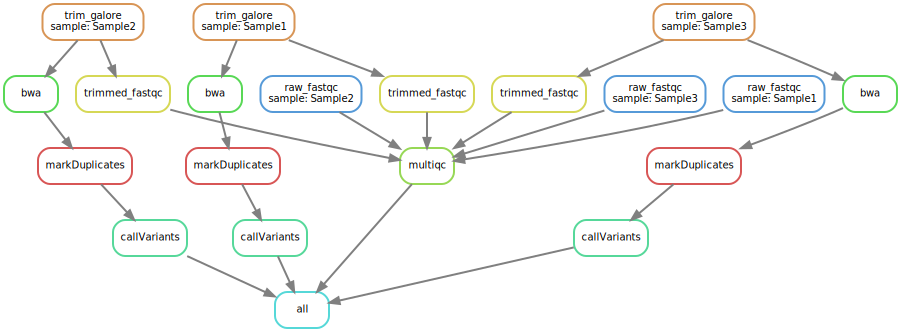
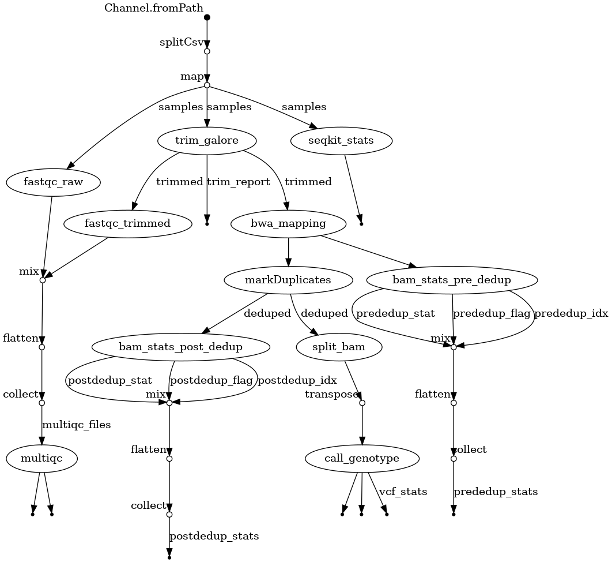

# To snake or to flow: comparison of Snakemake and Nextflow
---
Authors: [Lloyd Low](https://researchers.adelaide.edu.au/profile/wai.low)

Role: Senior Bioinformatician

Affiliation: University of Adelaide

*14/12/2023*

## Table of Contents
* [Workflow management system](#workflow)
* [Prerequisites](#pre)
* [Dataset](#data)
* [Shell scripting](#shell)
* [Snakemake](#snakemake)
* [Nextflow](#nextflow)
* [Acknowledgements](#Acknowledgements)
* [Further self learning](#further)

<a name="workflow"></a>
## Workflow management system
Computational pipelines are integral in bioinformatics, particularly for high-throughput sequenced data. While traditional Shell scripting is a common method, alternatives like Snakemake and Nextflow have gained popularity. Notably, the [verkko assembler](https://github.com/marbl/verkko) for assembling complete human telomere-to-telomere genomes uses a Snakemake pipeline whereas many workflows customised to the use of Oxford Nanopore Technologies long reads use [Nextflow pipelines](https://labs.epi2me.io/wfindex/). This workshop addresses common queries such as the choice between Shell scripting and workflow management systems like Snakemake or Nextflow. By demonstrating variant calling with both Shell scripts and these systems, the workshop provides insights into factors to consider, including scalability. Pros and cons of each method underscore the idea that the optimal approach depends on specific task requirements and features.

Why you should consider learning a proper workflow manager?
* Reproducibility ([think container](https://www.nextflow.io/docs/latest/container.html))
* Efficiency (think parallel executions)
* Ease of resuming partially completed runs

<a name="pre"></a>
## Prerequisites

* Knowledge of Linux and basic skills in installing tools
* Knowledge in Shell scripting is assumed for this workshop

<a name="data"></a>
## Dataset

<details>
<summary>
<i> Raw fastq files and a reference genome </i>
</summary>
<p>

### Raw fastq files

Sample1.R1.fastq.gz

Sample1.R2.fastq.gz

Sample2.R1.fastq.gz

Sample2.R2.fastq.gz

Sample3.R1.fastq.gz

Sample3.R2.fastq.gz

### Reference genome (only chr 28 and chr 29)

ARS-UCD2.0_demo.fa

ARS-UCD2.0_demo.fa.amb

ARS-UCD2.0_demo.fa.ann

ARS-UCD2.0_demo.fa.bwt

ARS-UCD2.0_demo.fa.fai

ARS-UCD2.0_demo.fa.pac

ARS-UCD2.0_demo.fa.sa

Download here:

https://drive.google.com/drive/folders/1UQCkgNg2AAjP4ctD3K-ISc8EWVulngaM?usp=drive_link

</p>
</details>

<a name="shell"></a>
## Shell scripting

This shell script will process the raw fastq files, map to a reference genome and call single nucleotide polymorphisms (SNPs).

The steps are

* Raw reads fastqc
* Clean and trim reads
* Fastqc on trimmed reads
* Mapping to a ref with BWA
* Mark duplicates with Picard or SamBamba
* Samtools stats, idxstats, flagstats on the BAM files
* Call variants using bcfools (OPTIONAL: split by chromosome)
* Multiqc report

```bash
#!/bin/bash

#conda activate insyb2023 #ensure all tools such as fastqc, seqkit etc are available

#define variables
taskcpus=8
read1=Sample1.R1.fastq.gz
read2=Sample1.R2.fastq.gz
sampleID=Sample1
read1trimmed=Sample1.R1_val_1.fq.gz
read2trimmed=Sample1.R2_val_2.fq.gz
ref=ARS-UCD2.0_demo.fa
avail_mem=3
bam=Sample1.sorted.bam
dedupbam=Sample1.markDup.bam

#ensure ref and raw fastq are here
# ln -s ../raw_fastq/Sample1.R1.fastq.gz ../raw_fastq/Sample1.R2.fastq.gz .
# ln -s ../reference/* .

#fastqc_raw
fastqc -t ${taskcpus} ${read1} ${read2}

#seqkit_stats
seqkit stats -j ${taskcpus} ${read1} ${read2} > ${sampleID}.seqkit.stats

#trim_galore
trim_galore --quality 30 \
    --length 75 \
    --clip_R1 1 \
    --clip_R2 1 \
    --three_prime_clip_R1 1 \
    --three_prime_clip_R2 1 \
    --paired \
    --cores ${taskcpus} \
    ${read1} ${read2}

#fastqc_trimmed
fastqc -t ${taskcpus} ${read1trimmed} ${read2trimmed}

#bwa_mapping
bwa mem -M \
        -t ${taskcpus} \
        -R "@RG\tID:${sampleID}\tPL:${sampleID}\tLB:${sampleID}\tSM:${sampleID}" \
        $ref \
        ${read1trimmed} ${read2trimmed} \
        | samtools sort --threads ${taskcpus} -o ${sampleID}.sorted.bam

#picard_markDuplicates
java -jar -Xmx${avail_mem}g /home/lloyd/Software/picard/build/libs/picard.jar MarkDuplicates \
                I=${bam} \
                O=${sampleID}.markDup.bam \
                M=${sampleID}.markDup.metrics.txt \
                VALIDATION_STRINGENCY=LENIENT \
                REMOVE_DUPLICATES=false \
                OPTICAL_DUPLICATE_PIXEL_DISTANCE=100 \
                CREATE_INDEX=false
samtools index ${sampleID}.markDup.bam

#bam_stats_pre_dedup
samtools index ${bam}
samtools stats ${bam} > ${sampleID}.prededup.stats
samtools flagstat ${bam} > ${sampleID}.prededup.flagstat
samtools idxstats ${bam} > ${sampleID}.prededup.idxstats

#bam_stats_post_dedup
samtools stats ${dedupbam} > ${sampleID}.postdedup.stats
samtools flagstat ${dedupbam} > ${sampleID}.postdedup.flagstat
samtools idxstats ${dedupbam} > ${sampleID}.postdedup.idxstats

#split_bam
samtools idxstats ${dedupbam} | cut -f 1 | grep -v '*' > ${sampleID}.chromosomes.txt
while IFS= read -r line; do
    samtools view -b ${dedupbam} ${line} > ${sampleID}.${line}.bam ;
    samtools index ${sampleID}.${line}.bam
done < ${sampleID}.chromosomes.txt

#call_genotype
while IFS= read -r line; do
    chromosome=$line
    finalbamExample=${sampleID}.${chromosome}.bam

    bcftools mpileup -f ${ref} ${finalbamExample} | \
    bcftools call --threads ${taskcpus} -m --output-type z | \
    bcftools filter --threads ${taskcpus} --output-type z \
    -s LowQual -e 'QUAL<20 || DP<100' > ${sampleID}.${chromosome}.vcf.gz
    bcftools index ${sampleID}.${chromosome}.vcf.gz
    bcftools stats ${sampleID}.${chromosome}.vcf.gz > ${sampleID}.${chromosome}.vcf.stats

done < ${sampleID}.chromosomes.txt
```  

<a name="snakemake"></a>
## Snakemake


I recommend [Snakemake tutorial](https://snakemake.readthedocs.io/en/stable/tutorial/tutorial.html) and this paper by [Koster and Rahmann 2012](https://academic.oup.com/bioinformatics/article/28/19/2520/290322) on its history.

Both Snakemake and Nextflow are using dataflow programming language. Think of this as mapping on inputs and outputs; jobs that have gathered all required inputs will immediately run. Print out the directed acyclic graph will help you visualize your jobs.

Directory structure (when run is complete, so some folders won't be displayed if you start from sratch)
```console
$ ls -lah
total 70K
drwxrwsr-x  6 lloyd lloyd   11 Dec 14 11:39 .
drwxrwsr-x 10 lloyd lloyd   10 Dec 13 18:52 ..
-rw-rw-r--  1 lloyd lloyd  164 Dec 13 22:46 config.yaml
-rw-rw-r--  1 lloyd lloyd  203 Dec 13 18:52 environment.yaml
drwxrwsr-x  4 lloyd lloyd    4 Dec 13 22:41 input_data
drwxrwsr-x  7 lloyd lloyd    7 Dec 14 11:43 logs
-rw-rw-r--  1 lloyd lloyd  218 Dec 13 23:08 mylog
drwxrwsr-x  8 lloyd lloyd    8 Dec 14 11:43 results
-rw-rw-r--  1 lloyd lloyd  17K Dec 14 11:31 snakedag.svg
-rw-rw-r--  1 lloyd lloyd 4.1K Dec 13 23:17 Snakefile
drwxrwsr-x 11 lloyd lloyd   11 Dec 14 11:39 .snakemake
```

Config and environment
```console
$ cat config.yaml
samples:
  - Sample1
  - Sample2
  - Sample3

reference: /data/home/misc/Snakemake_vs_nextflow/code_club/snakemake_version2/input_data/reference/ARS-UCD2.0_demo.fa

$ cat environment.yaml
channels:
  - bioconda
  - conda-forge
dependencies:
  - snakemake-minimal >=7.3
  - jinja2
  - matplotlib
  - graphviz
  - bcftools =1.15
  - samtools =1.15
  - bwa =0.7.17
  - pysam =0.19
  - pygments
```

How to run snakemake?
```console
conda activate lloydcondaenv
snakemake -n -s Snakefile --configfile config.yaml
snakemake -n -s Snakefile --configfile config.yaml --dag | dot -Tsvg > snakedag.svg
snakemake --cores 16 -s Snakefile --configfile config.yaml
```

The snake dag ... 

The snakefile
```python3
rule all:
	input:
		"results/multiqc/multiqc_report.html",
		#expand("results/trim_galore/{sample}_{read}_val_{read}.fq.gz", sample=config["samples"], read=["1", "2"]),
		#expand("results/bwa/{sample}.bam", sample=config["samples"]),
		expand("results/bcftools/{sample}.vcf.gz", sample=config["samples"])

rule raw_fastqc:
	input:
		r1="/data/home/misc/Snakemake_vs_nextflow/code_club/snakemake_version2/input_data/raw_fastq/{sample}.R1.fastq.gz",
		r2="/data/home/misc/Snakemake_vs_nextflow/code_club/snakemake_version2/input_data/raw_fastq/{sample}.R2.fastq.gz"

	output:
		"results/fastqc/raw/{sample}.R1_fastqc.html",
		"results/fastqc/raw/{sample}.R2_fastqc.html"

	params:
		threads=4

	log:
		"logs/fastqc/raw/{sample}.log"

	shell:
		"""
		fastqc -t {params.threads} {input.r1} {input.r2} --outdir results/fastqc/raw &> {log}
		"""

rule trim_galore:
	input:
		r1="/data/home/misc/Snakemake_vs_nextflow/code_club/snakemake_version2/input_data/raw_fastq/{sample}.R1.fastq.gz",
		r2="/data/home/misc/Snakemake_vs_nextflow/code_club/snakemake_version2/input_data/raw_fastq/{sample}.R2.fastq.gz"

	output:
		"results/trim_galore/{sample}.R1_val_1.fq.gz",
		"results/trim_galore/{sample}.R2_val_2.fq.gz"

	params:
		threads=4

	log:
		"logs/trim_galore/{sample}.log"

	shell:
		"""
		trim_galore --quality 30 \
    	--length 75 \
    	--clip_R1 1 \
    	--clip_R2 1 \
    	--three_prime_clip_R1 1 \
    	--three_prime_clip_R2 1 \
    	--paired \
    	--cores {params.threads} \
		{input.r1} {input.r2} -o results/trim_galore &> {log}
		"""

rule trimmed_fastqc:
	input:
		r1="results/trim_galore/{sample}.R1_val_1.fq.gz",
		r2="results/trim_galore/{sample}.R2_val_2.fq.gz"

	output:
		"results/fastqc/trimmed/{sample}.R1_val_1_fastqc.html",
		"results/fastqc/trimmed/{sample}.R2_val_2_fastqc.html"

	params:
		threads=4

	log:
		"logs/fastqc/trimmed/{sample}.log"

	shell:
		"""
		fastqc -t {params.threads} {input.r1} {input.r2} --outdir results/fastqc/trimmed &> {log}
		"""

rule bwa:
	input:
		r1="results/trim_galore/{sample}.R1_val_1.fq.gz",
		r2="results/trim_galore/{sample}.R2_val_2.fq.gz"

	output:
		"results/bwa/{sample}.bam"

	params:
		threads=4

	log:
		"logs/bwa/{sample}.log"

	shell:
		"""
		bwa mem -t {params.threads} \
		-R "@RG\\tID:{wildcards.sample}\\tSM:{wildcards.sample}\\tPL:{wildcards.sample}" \
		{config[reference]} \
		{input.r1} {input.r2} | \
		samtools view -b - | samtools sort -o {output} &> {log}
		samtools index {output}
		"""

rule markDuplicates:
	input:
		"results/bwa/{sample}.bam"

	output:
		"results/picard/{sample}.markDup.bam"

	log:
		"logs/picard/{sample}.log"

	shell:
		"""
		java -jar -Xmx3g /home/lloyd/Software/picard/build/libs/picard.jar MarkDuplicates  \
        I={input} \
        O=results/picard/{wildcards.sample}.markDup.bam \
        M=results/picard/{wildcards.sample}.markDup.metrics.txt \
        VALIDATION_STRINGENCY=LENIENT \
        REMOVE_DUPLICATES=false \
        OPTICAL_DUPLICATE_PIXEL_DISTANCE=100 \
        CREATE_INDEX=false
    samtools index results/picard/{wildcards.sample}.markDup.bam
	"""

rule callVariants:
	input:
		"results/picard/{sample}.markDup.bam"

	output:
		"results/bcftools/{sample}.vcf.gz"

	threads: 4

	log:
		"logs/bcftools/{sample}.log"

	shell:
		"""
		bcftools mpileup -f {config[reference]} {input} | \
    	bcftools call --threads {threads} -m --output-type z | \
    	bcftools filter --threads {threads} --output-type z -s LowQual -e 'QUAL<20 || DP<100' > results/bcftools/{wildcards.sample}.vcf.gz
    	bcftools index results/bcftools/{wildcards.sample}.vcf.gz
		bcftools stats results/bcftools/{wildcards.sample}.vcf.gz > results/bcftools/{wildcards.sample}.vcf.stats
		"""

rule multiqc:
	input:
		expand("results/fastqc/raw/{sample}.R{read}_fastqc.html", sample=config["samples"], read=["1", "2"]),
		expand("results/fastqc/trimmed/{sample}.R{read}_val_{read}_fastqc.html", sample=config["samples"], read=["1", "2"]),
		#expand("results/trim_galore/{sample}_{read}_val_{read}.fq.gz", sample=config["samples"], read=["1", "2"]),

	output:
		"results/multiqc/multiqc_report.html"

	shell:
		"""
		multiqc results/fastqc/raw results/fastqc/trimmed -o results/multiqc
		"""
```

<a name="nextflow"></a>
## Nextflow


I recommend [Nextflow tutorial](https://www.nextflow.io/docs/latest/getstarted.html) and this simple example with [blast](https://www.nextflow.io/example3.html).

Directory structure (when run is complete, so some folders won't be displayed if you start from sratch)
```console
$ ls -lah
total 76K
drwxrwsr-x  8 lloyd lloyd   16 Dec 14 12:12 .
drwxrwsr-x 10 lloyd lloyd   10 Dec 13 18:52 ..
drwxrwsr-x  2 lloyd lloyd    3 Dec 13 10:49 conf
-rw-rw-r--  1 lloyd lloyd 2.0K Dec 14 12:12 dag-20231214-43761650.html
drwxrwsr-x  4 lloyd lloyd    4 Dec 13 10:49 input_data
-rw-rw-r--  1 lloyd lloyd  206 Dec 13 10:49 insyb2023.yaml
-rw-rw-r--  1 lloyd lloyd 2.8K Dec 13 19:27 main.bkup.nf
-rw-rw-r--  1 lloyd lloyd 2.8K Dec 13 19:31 main.nf
drwxrwsr-x  2 lloyd lloyd    5 Dec 13 19:28 modules
-rw-rw-r--  1 lloyd lloyd  234 Dec 13 19:29 mylog
drwxrwsr-x  4 lloyd lloyd    5 Dec 14 12:12 .nextflow
-rw-rw-r--  1 lloyd lloyd 1.8K Dec 13 13:30 nextflow.config
-rw-rw-r--  1 lloyd lloyd  31K Dec 14 12:12 .nextflow.log
drwxrwsr-x  9 lloyd lloyd    9 Dec 14 12:11 results
-rw-rw-r--  1 lloyd lloyd  688 Dec 13 10:49 samplesheet.csv
drwxrwsr-x 32 lloyd lloyd   32 Dec 14 12:12 work
```

YAML file to install dependencies in a new conda environment
```console
$ cat insyb2023.yaml
name: insyb2023
channels:
  - conda-forge
  - bioconda
  - defaults
dependencies:
  - bcftools
  - bwa
  - cutadapt
  - fastqc=0.12.1=hdfd78af_0
  - sambamba
  - samtools=1.10
  - multiqc
  - trim-galore

mamba env create -f insyb2023.yaml
```

Base config
```console
$ cat conf/base.config
/*
~~~~~~~~~~~~~~~~~~~~~~~~~~~~~~~~~~~~~~~~~~~~~~~~~~~~~~~~~~~~~~~~~~~~~~~~~~~~~~~~~~~~~~~
    A 'blank slate' config file, appropriate for general use on most high performance
    compute environments. Assumes that all software is installed and available on
    the PATH. Runs in `local` mode - all jobs will be run on the logged in environment.
----------------------------------------------------------------------------------------
*/

process {

    cpus   = { check_max( 1    * task.attempt, 'cpus'   ) }
    memory = { check_max( 6.GB * task.attempt, 'memory' ) }
    time   = { check_max( 4.h  * task.attempt, 'time'   ) }

    errorStrategy = { task.exitStatus in ((130..145) + 104) ? 'retry' : 'finish' }
    maxRetries    = 1
    maxErrors     = '-1'

    // Process-specific resource requirements
    // NOTE - Please try and re-use the labels below as much as possible.
    //        These labels are used and recognised by default in DSL2 files hosted on nf-core/modules.
    //        If possible, it would be nice to keep the same label naming convention when
    //        adding in your local modules too.
    // See https://www.nextflow.io/docs/latest/config.html#config-process-selectors
    withLabel:process_single {
        cpus   = 1
        memory = 1.GB
        time   = 2.h
    }
    withLabel:process_low {
        cpus   = 4
        memory = 4.GB
        time   = 8.h
    }
    withLabel:process_medium {
        cpus   = 8
        memory = 12.GB
        time   = 16.h
    }
    withLabel:process_high {
        cpus   = 16
        memory = 32.GB
        time   = 20.h
    }
    withLabel:process_heavy {
        cpus = 16
        memory = 48.GB
        time = 10.h
    }
    withLabel:error_ignore {
        errorStrategy = 'ignore'
    }
    withLabel:error_retry {
        errorStrategy = 'retry'
        maxRetries    = 2
    }
}
```

Nextflow config
```console
$ cat nextflow.config
/*
 * This Source Code Form is subject to the terms of the Mozilla Public
 * License, v. 2.0. If a copy of the MPL was not distributed with this
 * file, You can obtain one at http://mozilla.org/MPL/2.0/.
 *
 * This Source Code Form is "Incompatible With Secondary Licenses", as
 * defined by the Mozilla Public License, v. 2.0.
 *
 */

manifest {
  description = 'SNP Probe Caputre Seq Pipeline'
  author = 'Callum MacPhillamy'
}

params {
  max_cpus = 16
}

includeConfig 'conf/base.config'

/*
 * defines execution profiles for different environments  
 */

profiles {

  conda_local {
    process.conda = "/home/lloyd/mambaforge/envs/insyb2023"
    conda.enabled = true
    process.executor = 'local'
  }

}


def check_max(obj, type) {
    if (type == 'memory') {
        try {
            if (obj.compareTo(params.max_memory as nextflow.util.MemoryUnit) == 1)
                return params.max_memory as nextflow.util.MemoryUnit
            else
                return obj
        } catch (all) {
            println "   ### ERROR ###   Max memory '${params.max_memory}' is not valid! Using default value: $obj"
            return obj
        }
    } else if (type == 'time') {
        try {
            if (obj.compareTo(params.max_time as nextflow.util.Duration) == 1)
                return params.max_time as nextflow.util.Duration
            else
                return obj
        } catch (all) {
            println "   ### ERROR ###   Max time '${params.max_time}' is not valid! Using default value: $obj"
            return obj
        }
    } else if (type == 'cpus') {
        try {
            return Math.min( obj, params.max_cpus as int )
        } catch (all) {
            println "   ### ERROR ###   Max cpus '${params.max_cpus}' is not valid! Using default value: $obj"
            return obj
        }
    }
}
```

Using a sample sheet.
```console
$ cat samplesheet.csv
sampleID,read1,read2
Sample1,/data/home/misc/Snakemake_vs_nextflow/code_club/nextflow_version2/input_data/raw_fastq/Sample1.R1.fastq.gz,/data/home/misc/Snakemake_vs_nextflow/code_club/nextflow_version2/input_data/raw_fastq/Sample1.R2.fastq.gz
Sample2,/data/home/misc/Snakemake_vs_nextflow/code_club/nextflow_version2/input_data/raw_fastq/Sample2.R1.fastq.gz,/data/home/misc/Snakemake_vs_nextflow/code_club/nextflow_version2/input_data/raw_fastq/Sample2.R2.fastq.gz
Sample3,/data/home/misc/Snakemake_vs_nextflow/code_club/nextflow_version2/input_data/raw_fastq/Sample3.R1.fastq.gz,/data/home/misc/Snakemake_vs_nextflow/code_club/nextflow_version2/input_data/raw_fastq/Sample3.R2.fastq.gz
```

The main nextflow file.
```console
$ cat main.nf
// Set the DSL syntax to version 2
nextflow.enable.dsl=2

/*
 * PARAMETERS
 */
params.samplesheet = null
params.outdir = "${baseDir}/results"
params.reference = null


/*
 * CHECK INPUTS
 */

if (params.samplesheet == null) {
	error "Please provide a sample sheet using the `--samplesheet` flag"
	System.exit(1)
}
if (params.reference == null) {
	error "Please provide a reference genome using the `--reference` flag"
	System.exit(1)
}


log.info """\
N E X T F L O W -- V A R I A N T   C A L L I N G   D E M O
===========================================================

Pipeline Parameters:
		Sample sheet:     ${params.samplesheet}
		Output directory: ${params.outdir}
		Reference genome: ${params.reference}

===========================================================
"""

// Create input channel from the sample sheet
Channel
	.fromPath(params.samplesheet, checkIfExists: true)
	.splitCsv(header: true)
	.map ( row -> tuple(row.sampleID, row.read1, row.read2) )
	.set { samples }

//samples.view()


/*
 * Import the process from the modules dir
 */
include { fastqc_raw } from './modules/qc'
include { seqkit_stats } from './modules/qc'
include { trim_galore } from './modules/qc'
include { fastqc_trimmed } from './modules/qc'
include { multiqc } from './modules/qc'
include { bwa_mapping } from './modules/mapping'
include { picard_markDuplicates as markDuplicates } from './modules/mapping'
include { bam_stats_pre_dedup } from './modules/mapping'
include { bam_stats_post_dedup } from './modules/mapping'
include { split_bam } from './modules/call_variants'
include { call_genotype } from './modules/call_variants'

/*
 * DEFINE THE WORKFLOW
 */

workflow {
	fastqc_raw_report = fastqc_raw(samples)
	(trimmed, trim_report) = trim_galore(samples)
	fastqc_trim_report = fastqc_trimmed(trimmed)
    seq_stats = seqkit_stats(samples)
	mapped = bwa_mapping(trimmed)
	(deduped, metrics) = markDuplicates(mapped)

	// Stats on alignment prior to duplicate marking
	(prededup_stat, prededup_flag, prededup_idx) = bam_stats_pre_dedup(mapped)
	prededup_stats = prededup_stat.mix( prededup_flag, prededup_idx ).flatten().collect()


	// Stats on alignment after duplicate marking
	(postdedup_stat, postdedup_flag, postdedup_idx) = bam_stats_post_dedup(deduped)
	postdedup_stats = postdedup_stat.mix( postdedup_flag, postdedup_idx ).flatten().collect()

    split = split_bam(deduped)
    //split.transpose().view()
    //split.view()
    vcf_stats = call_genotype(split.transpose()).stats

	//multiqc_files = fastqc_raw_report.mix( fastqc_trim_report, trim_report, prededup_stats, postdedup_stats, vcf_stats, seq_stats, metrics ).flatten().collect()
	multiqc_files = fastqc_raw_report.mix( fastqc_trim_report ).flatten().collect()
	//multiqc_files.view()
	multiqc(multiqc_files)
  ```

QC
```console
$ cat qc.nf
// FastQC
process fastqc_raw {
	tag "$sampleID"
    label "process_low"
    //debug true

    publishDir "${params.outdir}/fastqc/raw", mode: 'copy',
		saveAs: { filename -> filename.endsWith(".html") ? filename : "zips/$filename"}

    input:
    tuple val(sampleID), path(read1), path(read2)

    output:
    path "*.{zip,html}", emit: fastqc_raw_report

    script:
    """
    fastqc -t ${task.cpus} ${read1} ${read2}
    """
}

// Check Raw Reads
process seqkit_stats {
    tag "$sampleID"
    label "process_low"

    publishDir "${params.outdir}/seqkit", mode: 'copy'

    input:
    tuple val(sampleID), path(read1), path(read2)

    output:
    path "${sampleID}.seqkit.stats", emit: seqkit_stats

    script:
    """
    seqkit stats -j ${task.cpus} ${read1} ${read2} > ${sampleID}.seqkit.stats
    """
}

// Trim_Galore
process trim_galore {
    tag "$sampleID"
    label "process_low"
    //debug true

    publishDir "${params.outdir}/trimmed", mode: 'copy',
		saveAs: { filename -> filename.endsWith(".txt") ? "logs/$filename" : filename }

    input:
    tuple val(sampleID), path(read1), path(read2)

    output:
    tuple val(sampleID), path("${sampleID}*_val_1.fq.gz"), path("${sampleID}*_val_2.fq.gz"), emit: trimmed
    path "*.txt", emit: trim_galore_report

    script:
    """
    trim_galore --quality 30 \
    --length 75 \
    --clip_R1 1 \
    --clip_R2 1 \
    --three_prime_clip_R1 1 \
    --three_prime_clip_R2 1 \
    --paired \
    --cores ${task.cpus} \
    ${read1} ${read2}
    """
}

process fastqc_trimmed {
    tag "$sampleID"
    label "process_low"

    publishDir "${params.outdir}/fastqc/trimmed", mode: 'copy',
		saveAs: { filename -> filename.endsWith(".html") ? filename : "zips/$filename"}

    input:
    tuple val(sampleID), path(read1), path(read2)

    output:
    path "*.{zip,html}", emit: fastqc_trimmed_report

    script:
    """
    fastqc -t ${task.cpus} ${read1} ${read2}
    """
}

process multiqc {
	tag "multiqc"
	label "process_low"
	publishDir "${params.outdir}/multiqc", mode: 'copy'


	input:
	path multiqc_files, stageAs: "?/*"

	output:
	path "*.html"
	path "*_data"
	//path "*_plots"

	script:
	"""
	multiqc ${multiqc_files}
	"""
}
```

Mapping
```console
$ cat mapping.nf
process bwa_mapping {
    tag "$sampleID"
    label "process_high"
    //debug true

    publishDir "$params.outdir/bwa/", mode: 'copy'

    input:
    tuple val(sampleID), path(read1), path(read2)


    output:
    tuple val(sampleID), path("${sampleID}.sorted.bam")

    script:
    ref = params.reference
    rg = "\'@RG\\tID:${sampleID}\\tPL:${sampleID}\\tLB:${sampleID}\\tSM:${sampleID}\'"
    """
    bwa mem -M \
        -t ${task.cpus} \
        -R $rg \
        $ref \
        ${read1} ${read2} \
        | samtools sort --threads ${task.cpus} -o ${sampleID}.sorted.bam
    """
}

process sambamba_markDuplicates {
    tag "$sampleID"
    label "process_heavy"
    debug true

    publishDir "$params.outdir/markDuplicates/", mode: 'copy',
        saveAs: { filename -> filename.endsWith(".txt") ? "logs/$filename" : filename}

    input:
    tuple val(sampleID), path(bam)

    output:
    tuple val(sampleID), path("${sampleID}.markDup.bam"), path("${sampleID}.markDup.bam.bai"), emit: markdup
    //path("${sampleID}.markDup.metrics.txt")

    script:
    """
    sambamba markdup -t ${task.cpus} ${bam} ${sampleID}.markDup.bam
    samtools index ${sampleID}.markDup.bam
    """
}

process picard_markDuplicates {
    tag "$sampleID"
    label "process_picard"
    debug true

    publishDir "$params.outdir/markDuplicates", mode: 'copy'

    input:
    tuple val(sampleID), path(bam)

    output:
    tuple val(sampleID), path("${sampleID}.markDup.bam"), path("${sampleID}.markDup.bam.bai"), emit: markdup

    script:
    avail_mem = 3
    if (!task.memory) {
        log.info 'No memory specified, using default 3GB'
    } else {
        avail_mem = task.memory.toGiga()
    }
    """
    java -jar -Xmx${avail_mem}g /home/lloyd/Software/picard/build/libs/picard.jar MarkDuplicates \
        I=${bam} \
        O=${sampleID}.markDup.bam \
        M=${sampleID}.markDup.metrics.txt \
        VALIDATION_STRINGENCY=LENIENT \
        REMOVE_DUPLICATES=false \
        OPTICAL_DUPLICATE_PIXEL_DISTANCE=100 \
        CREATE_INDEX=false
    samtools index ${sampleID}.markDup.bam
    """
}

process bam_stats_pre_dedup {
	tag "$sampleID"
    label "process_medium"
    //debug true

    publishDir "$params.outdir/bwa/stats", mode: 'copy'

    input:
    tuple val(sampleID), path(bam)

    output:
    path "${sampleID}.prededup.stats", emit: prededup_stats
	path "${sampleID}.prededup.flagstat", emit: prededup_flagstat
	path "${sampleID}.prededup.idxstats", emit: prededup_idxstats

    script:
    """
    samtools index ${bam}
    samtools stats ${bam} > ${sampleID}.prededup.stats
	samtools flagstat ${bam} > ${sampleID}.prededup.flagstat
	samtools idxstats ${bam} > ${sampleID}.prededup.idxstats
    """
}

process bam_stats_post_dedup {
	tag "$sampleID"
    label "process_medium"
    //debug true

    publishDir "$params.outdir/bwa/stats", mode: 'copy'

    input:
    tuple val(sampleID), path(bam), path(bai)

    output:
    path "${sampleID}.postdedup.stats", emit: postdedup_stats
	path "${sampleID}.postdedup.flagstat", emit: postdedup_flagstat
	path "${sampleID}.postdedup.idxstats", emit: postdedup_idxstats

    script:
    """
    samtools stats ${bam} > ${sampleID}.postdedup.stats
	samtools flagstat ${bam} > ${sampleID}.postdedup.flagstat
	samtools idxstats ${bam} > ${sampleID}.postdedup.idxstats
    """
}
```

Call variants
```console
$ cat call_variants.nf
process split_bam {
    tag "$sampleID"
    label "process_medium"
    //debug true

    publishDir "$params.outdir/bwa/split_bam", mode: 'copy'

    input:
    tuple val(sampleID), path(bam), path(bai)

    output:
    tuple val(sampleID), path("${sampleID}.*.bam"), path("${sampleID}.*.bam.bai"), emit: split_bam

    shell:
    '''
    samtools idxstats !{bam} | cut -f 1 | grep -v '*' > !{sampleID}.chromosomes.txt
    while IFS= read -r line; do
        samtools view -b !{bam} ${line} > !{sampleID}.${line}.bam ;
        samtools index !{sampleID}.${line}.bam
    done < !{sampleID}.chromosomes.txt
    '''
}

// Updated version of call_genotype using bcftools version 1.18
process call_genotype {
    tag "$sampleID"
    label "process_medium"

    publishDir "${params.outdir}/genotype_calls", mode: 'copy'

    input:
    tuple val(sampleID), path(bam), path(bai)

    output:
    path "${sampleID}.*.vcf.gz"
    path "${sampleID}.*.vcf.gz.csi"
	path "${sampleID}.*.vcf.stats", emit: stats

    script:
    chromosome = bam.toString().split("\\.")[1]
    """
    bcftools mpileup -f ${params.reference} ${bam} | \
    bcftools call --threads ${task.cpus} -m --output-type z | \
    bcftools filter --threads ${task.cpus} --output-type z -s LowQual -e 'QUAL<20 || DP<100' > ${sampleID}.${chromosome}.vcf.gz
    bcftools index ${sampleID}.${chromosome}.vcf.gz
	bcftools stats ${sampleID}.${chromosome}.vcf.gz > ${sampleID}.${chromosome}.vcf.stats
    """
}
```

How to run nextflow?
```console
conda activate nextflow
nextflow run main.nf --samplesheet samplesheet.csv --reference /data/home/misc/Snakemake_vs_nextflow/code_club/nextflow_version3/input_data/reference/ARS-UCD2.0_demo.fa -profile conda_local -with-dag
```

Nextflow dag ... 

<a name="Acknowledgements"></a>
## Acknowledgements

I thank the Davies coding club members for practicing on code similar to the one presented here. In particular, special thanks to Callum MacPhillamy, my post-doc, who coded the majority of the pipelines presented here.

<a name="further"></a>
## Further self learning
If you like to learn bioinformatics in this type of "workshop-style", consider getting my [book](https://www.worldscientific.com/worldscibooks/10.1142/12908#t=aboutBook).
